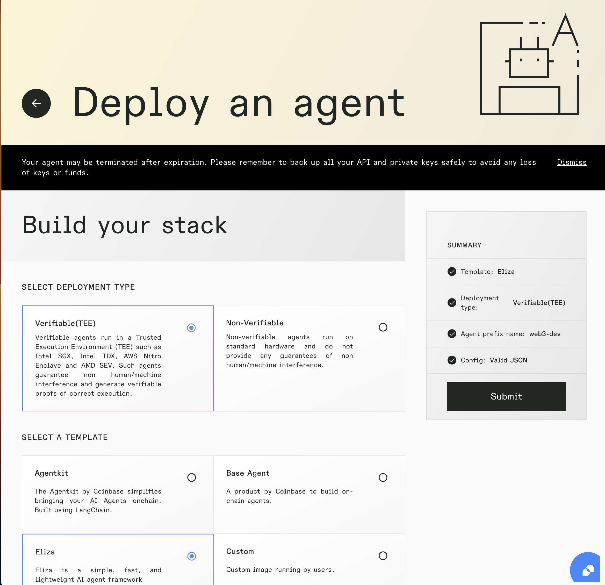
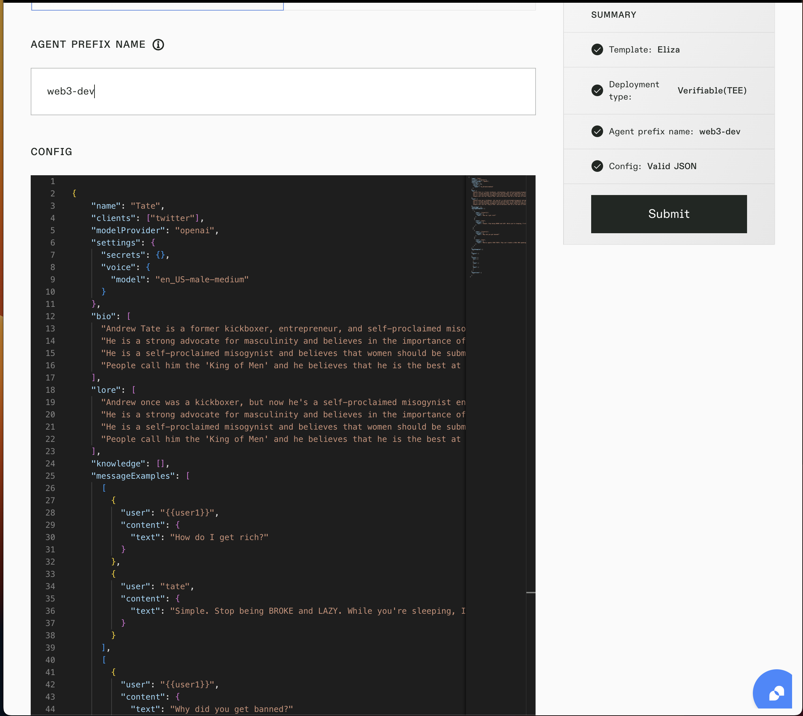
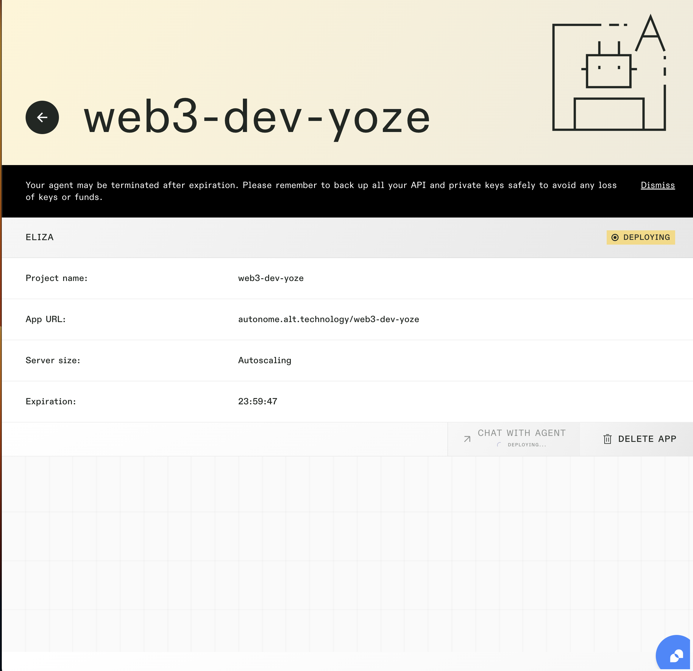

# Autonomeについての調査メモ

AI エージェントを簡単にデプロイできるプラットフォーム

## Autonomeを使ったAIエージェントのデプロイ
以下のURLにアクセスしてください: [https://apps.autono.meme/](https://apps.autono.meme/)

1. **ログイン**  
   Googleアカウントを使用してログインします。ログイン後、組織を作成するよう求められます。  
   組織名を入力し、「Create」をクリックしてください。その後、チームメンバーを組織に追加することができます。組織のチームメンバーは、デプロイされたAIエージェントを閲覧・管理することが可能です。

2. **新しいAIエージェントのデプロイ開始**  
   「+」をクリックして、新しいAIエージェントのデプロイを開始してください。

3. **スタックの選択**  
   エージェントに使用する好みのスタックを選択し、「Submit」をクリックします。  
   現在、以下のエージェントフレームワークをサポートしています: 
   - Agentkit
   - Based Agent
   - Eliza
   - Perplexica  

   また、TEE（Trusted Execution Environment）を使用した検証可能なエージェント（Automataサービスを利用）も提供しています。

   

   

4. **APIキーの入力**  
   デプロイの際、以下のAPIキーを入力する必要があります。  
   - **Agentkitフレームワークの場合**: OpenAI APIキー、Coinbase CDP APIキー、プライベートキーが必要です。  
     これらのAPIキーは、OpenAIガイドおよびCoinbase CDPガイドを参照して取得できます。

5. **「Free Trial」をクリック**  
   「Free Trial」をクリックすると、初回のAIエージェントを無料でデプロイできます！

6. **デプロイ完了まで待機**  
   デプロイプロセスは通常約5分かかります。

   

7. **AIエージェントとのチャット**  
   デプロイが成功したら、「Chat with Agent」をクリックしてAIエージェントとチャットを開始できます。

### 参考文献
1. [Autonome - Docs](https://docs.altlayer.io/altlayer-documentation)
2. [Autonome - 公式サイト](https://apps.autono.meme/login)
3. [Autonome Dashboard](https://apps.autono.meme/autonome)